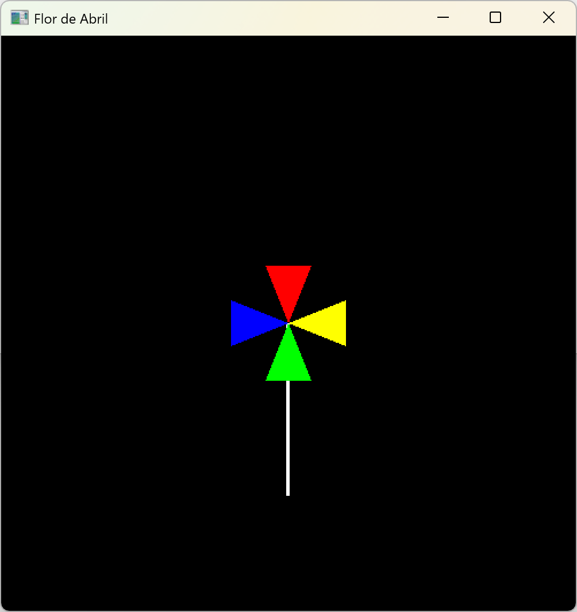

# Diretório de Atividades

## [Atividade 1: Algoritmo de Bresenham](./activity1/activity1.py)
Este exercício implementa o algoritmo de Bresenham para traçar linhas vetoriais em um plano matricial. O algoritmo é eficiente e amplamente utilizado em computação gráfica para desenhar linhas entre dois pontos.

A saída do algoritmo retorna uma lista de tuplas, onde as tupla representam as coordenadas dos pontos que formam a linha entre os pontos de início e fim especificados.
Segue um exemplo de uso do algoritmo:

```python
Pontos calculados pelo algoritmo de Bresenham:
(1, 1) (2, 2)(3, 2) (4, 3)  (5, 3) (6, 4) (7, 4) (8, 5)
```

> [!NOTE]
> A parte manuscrita da atividade [está disponível aqui](https://drive.google.com/file/d/1QeYxhLlDFvzG8X-So6OUxdDqNpHj3Ohu/view?usp=drive_link).

## [Atividade 2: Flor de Abril em OpenGL](./activity2/activity2.c)
Este exercício desenha uma "flor de abril" utilizando OpenGL. A flor é composta por um caule e quatro pétalas coloridas, cada uma desenhada como um triângulo.

> [!NOTE]
> Como resultado do exercício, você deve obter uma flor semelhante à imagem abaixo:
> 