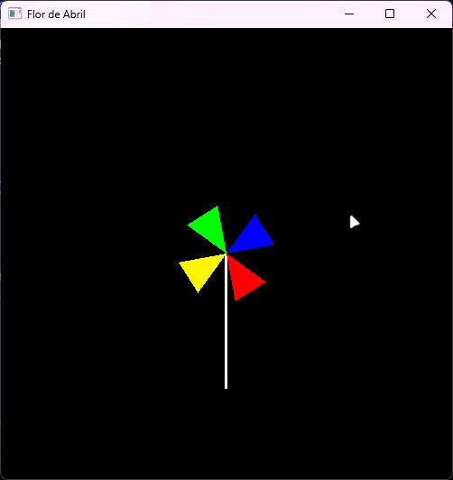

# [Atividade 3: A Flor de Abril agora é um catavento!](./activity3.c)

Este exercício expande a atividade anterior, onde a flor de abril agora se comporta como um catavento. A flor pode ser rotacionada no sentido horário ou anti-horário, dependendo da tecla pressionada.
Para rotacionar a flor, utilize as seguintes teclas:
- Pressione `r` para rotacionar no sentido horário.
- Pressione `e` para rotacionar no sentido anti-horário.

A flor também pode ser parada ao soltar as teclas, e a velocidade de rotação é limitada para evitar rotações muito rápidas.

> [!NOTE]
> Como resultado do exercício, você deve obter um catavento semelhante à animação abaixo:
> 

> [!WARNING]
> Devido a limitações de framerate do formato GIF (24 fps), a animação pode não ser tão suave quanto a implementação real.