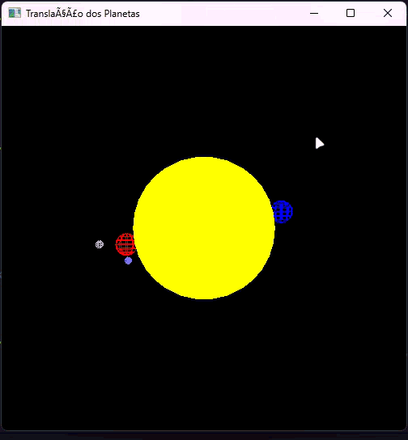

# [Atividade 4: Translação de planetas ao redor do sol com luas!](./activity4.c)

Este exercício propõe a criação de um sistema solar simples, onde dois planetas, nessa atividade azul e vermelho, giram ao redor do sol. Um dos planetas, no nosso caso, o vermelho, deve possuir duas luas que orbitam ao seu redor. Um das luas deve girar no eixo X, enquanto a outra deve girar no plano XY.

A rotação do planeta e das luas é controlada por uma variável de tempo, simulando o movimento orbital.

Para facilitar a visualização, o sol é opaco e os planetas são representados por esferas wireframe. As luas também são esferas wireframe, com cores diferentes para cada uma.

#### Observações:
- Fiz uso de `glEnable(GL_DEPTH_TEST);` para garantir que as esferas sejam desenhadas corretamente em relação à profundidade.
- Além disso, o código inclui uma rotação estética de 90 graus no eixo Y para alinhar a texture de wireframe dos planetas e luas.

> [!NOTE]
> Como resultado do exercício, você deve obter uma animação semelhante à imagem abaixo:
> 

> [!WARNING]
> Devido a limitações de framerate do formato GIF (24 fps), a animação pode não ser tão suave quanto a implementação real.

> O commit enviado antes do prazo da atividade foi o seguinte: https://github.com/theduardomaciel/cc-cg/commit/5512306185040e00a3fa12c3c44b37bad94d6867